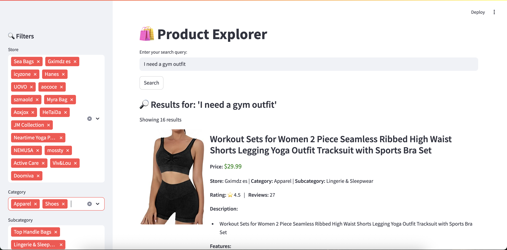
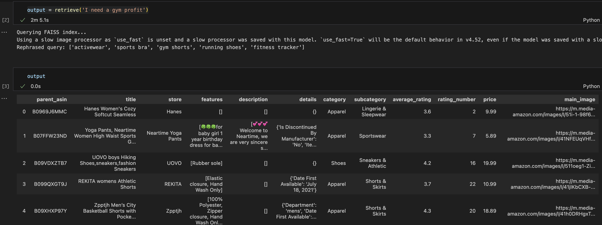

# Semantic Recommendation Prototype

- Last updated: 20250603
- Sun Weiran

## Overview

This project demonstrates a prototype recommending products from user's natrual language queries based on semantic search and OpenAI GPT 4.1. A simple streamlit user interface is included to illustrate how an end user might interact with the feature.



## Setup

### Installation
1. Python 3.11
2. `pip install -r requirements.txt`
3. Update `openai_api_key` in `config.py`
4. `streamlit run app.py`
5. try with "a red dress with floral pattern" or "I need a gym outfit"

### Code sturcture
```
openai-fashion/
├── architecture diagram/       # Data flow for both index creation and retrieval
├── data/                       # Meta_Amazon_Fashion.jsonl
├── demo/                       # Demo screenshot for readme
├── index/                      # Pretrained index and metadata
├── app.py                      # Streamlit app endpoint
├── config.py                   # Configuration file
├── data_process.py             # Data processing logic before embedding
├── embedding.py                # Embedding generation for both text and image
├── index.py                    # Index creation and retrieval
├── main.py                     # Main orchestrator
├── requirements.txt            # Python dependencies
├── README.md                   # Project documentation
├── sample_usage.ipynb          # Sample usage
```

### Usage
1. Retrieval:
    - From streamlit: `streamlit run app.py`, enter the search query then press search button. 
    
    - From function: `retrieve(query)` in `main.py`
2. Index generation:
    - Pre-trained indices are included under `index/`: `faiss_index.index` and `faiss_metadata.pkl`
    - For regeneration of the indices, use `index_creation` in `main.py`. Put `meta_Amazon_Fashion.jsonl` in `data/` folder

### Sample output
1. From UI:

    

2. From function:

    **Input:**
    ```
    from main import *
    output = retrieve('I need a gym outfit')
    ```

    **Output:**
    

### Important configs 
- img_ratio, text_ratio: used for mixing text and image embeddings, determines the relative ratio between text and images, should sum up to 1
- base_k: number of products retrieved for each keywords
- batch_size: batch size used during embedding creation. Setting to 100 due to limit compute

## Key Design Decisions

**1. Exclude Entries with Missing Main Image URLs or Prices**

- Products without a **price** are excluded, as price is a crucial attribute in purchase decisions.
- Products missing a **main image URL** are also excluded, as image embeddings require a visual input.
- This decision helps manage limited compute resources on a personal development machine.

**2. Combine Text and Image Embeddings**

- **Text alone** is often insufficient. For instance, “a red dress with floral patterns and long sleeves” may not be fully reflected from its text description.
- Both **text and image embeddings** are used to represent products more accurately.
- An initial weighting of **0.3 text / 0.7 image** is applied, with flexibility to adjust based on desired emphasis. I have experiemented on different weightage configuration and putting additional weights on the image generally enhance the search results

**3. Use Only the Main Product Image**

- While multiple images could provide richer embeddings, only the **main image** is used due to compute constraints.
- This simplification significantly reduces processing time and resource usage.

**4. Rephrase Intent-Based Queries Using GPT-4.1**

- Users often enter **intent-driven queries**, such as “I need a wedding dress” or “looking for gym clothes.”
- These queries do not align well with the embedding space, which is built on structured product descriptions and images.
- **GPT-4.1** is used to rewrite such queries into **product-style descriptions**, improving embedding alignment.
- Up to **5 rewritten descriptions** are generated per query to strike a balance between performance and variety.

**5. Post-Extraction Relevance Filtering via GPT-4.1**

- Retrieved results (up to **50**) are passed through a **relevance filter** using GPT-4.1.
- This acts as a quality control step: GPT-4.1 evaluates each product (using its **main image**) for alignment with the original user query.
- This significantly improves final result quality, though it is the **most time-consuming** part of the pipeline due to per-image API calls.
